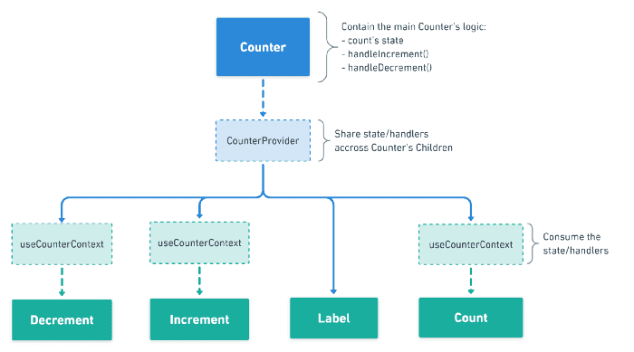

# 김윤성 202030304

## 5월 8일 강의 내용

### Arguments 전달하기

함수를 정의할 때는 파라미터(parameter) 혹은 매개변수 라고 부르고, 함수를 사용할 때는 아규먼트(Argument) 혹은 인수라고 부른다.  

event라는 매개변수는 리엑트의 이벤트 객체를 의미한다.  

### 엘리먼트 변수

렌더링해야 될 컴포넌트를 변수처럼 사용하는 방법이 엘리먼트 변수다.

### 인라인 조건

필요한 곳에 조건문을 직접 넣어 사용하는 방법  

### 인라인 if

if 문을 직접 사용하지 않고, 동일한 효과를 내기 위해 && 논리 연산자를 사용.  
&&은 and 연자로 모든 조건이 참일 때만 참이 된다.  
첫 번 조건이 거짓이면 두번 째 조건은 판단하지 않는다.  

### 인라인 if - else

삼항 연산자를 사용한다. 조건문 :? 참일 경우 : 거짓일 경우  
문자열이나 엘리먼트를 넣어서 사용할 수도 있다.

## 5월 1일 강의 내용

### 이벤트 처리하기

이벤트가 발생했을 때 이벤트를 처리하는 함수를 이벤트 핸들러 라고 한다.  

이벤트가 발생하는 것을 이벤트 리스너라고 한다.  

### 훅의 규칙

첫 번째 규칙은 무조건 최상위 레벨에서만 호출 되어야 한다.  
컴포넌트가 렌더링 될 때 마다 같은 순서로 호출되어야 한다.  
두 번째 규칙은 함수형 컴포넌트에서만 훅을 호출해야 한다는 것.  
함수형 컴포넌트 혹은 직접 만든 커스텀 훅에서만 호출할 수 있다.  

### 나만의 훅 만들기

직접 훅을 만들어 쓸 수 있는데, 이것을 커스텀 훅이라고 한다.  

### 이벤트 핸들러

추가하는 방법 이벤트 핸들러 함수인 handleClick() 함수를 호출 하도록 되어 있다.  
class 컴포넌트는 거의 사용하지 않는다.

## 4월 17일 강의 내용

### 훅

클래스형 컴포넌트에서 생성자에서 state를 정의하고, setState() 함수를 통해 state를 업데이트한다.  
예전에 사용하던 함수형 컴포넌트는 별도로 state를 정의하거나, 컴포넌트의 생명주기에 맞춰서 코드를 실행되도록 할 수 없었다.  
함수형 컴포넌트에서도 실행 가능하게 해준 것이 훅이다.  

### useState 

useState는 함수형 컴포넌트에서 state를 사용하기 위한 Hook임.  

### useEffect 

useState와 함께 가장 많이 사용하는 Hook.  
이 함수는 사이드 이펙트를 수행하기 위함임.  
영어로 side effect = 부작용 , 일반적으로 프로그래밍에서는 개발자가 의도하지 않은 코드가 실행되며 버그가 발생하는 것을 의미함.  
리엑트에서는 효과 또는 영향을 뜻하는 effect의 의미에 가까움. 서버에서 데이터를 받아오거나 수동으로 DOM을 변견하는 등의 작업을 의미. 
이 작업을 이펙트라고 부르는 이유는 이 작업이 다른 컴포넌트에 영향을 미칠 수 있으며, 렌더링중에는 작업이 완료될 수 없기 때문이다.  
클래스 컴포넌트의 생명주기 함수와 같은 기능을 하나로 통합된 기능을 제공한다.  
useEffect(이펙트 함수, 의존성 배열);  

### useRef
useRef() 혹은 레퍼런스를 사용하기 위한 훅.  
레퍼런스란 특정 컴포넌트에 접근할 수 있는 객체를 의미함.  
useRef() 훅은 래퍼런스 객체를 반환한다.  
래퍼넌스 객체에는 .current라는 속성이 있는데, 이것은 현재 참조하고 있는 엘리먼트를 의미한다.  

## 훅의 규칙
무조건 최상의 레벨에서만 호출해야 한다. 최상위는 컴포넌트의 최상위 레벨을 의미함. 반복문이나 조건문 또는 중첩된 함수들 안에서 훅을 호출 할 수 없음. 

## 4월 3일 강의 내용

### Props
props = property(속성, 특성)  
props = 컴포넌트의 속성  
컴포넌트에 어떤 props를 넣느냐에 따라서 다른 엘리먼트가 출력됨.  
props는 컴포넌트에 전달 할 다양한 정보를 담고 있는 자바스크립트 객체.  

### Props의 특징

읽기 전용. 변경할 수 없음.  
속성이 다른 엘리먼트를 생성하려면 새로운 props를 생성해야함.  

### Props 사용법
JSX에서는 key-value쌍으로 props를 구현한다.  
props를 통해서 value를 할당할 수도 있으며, 직접 중괄호를 사용하여 할당할 수도 있음.

### 컴포넌트의 종류

리엑트 초기 버전 -> 클래스형 컴포넌트를 주로 사용. 
이후 Hook 이라는 개념이 나오며 함수형 컴포넌트를 주로 사용함. 

### 컴포넌트 이름 짓기

이름은 항상 대문자로 시작한다. 소문자로 시작하면 컴포넌트를 DOM 태그로 인식하기 때문임.  
컴포넌트 파일 이름과 컴포턴트 이름은 같게한다.  

### 컴포넌트 추출

복잡한 컴포넌트를 쪼개서 여러 개의 컴포넌트로 나눌 수도 있음.  
큰 컴포넌트에서 일부를 추출해서 새로운 컴포넌트를 만드는 것.  

### State

state는 const, let 등으로 선언한 변수와 다르게 값이 변하면 관련 있는 컴포넌트들이 재렌더링되어 화면이 바뀌는 변수.  

state는 컴포넌트의 내부에서 변경 가능한 데이터를 다루기 위해 사용하는 객체이다.  

일반적으로 리액트에서는 유동적인 데이터는 변수에 담아서 사용하지 않고 useState()라는 리액트 함수를 사용하여 state라는 저장 공간에 담아 사용한다.  

State는 변경은 가능하지만 직접 수정해서는 안됨.  

### 생명주기

생명주기는 컴포넌트의 생성 시점, 사용 시점, 종료 시점을 나타내는 것.  
constructor가 실행 되면서 컴포넌트가 생성됨.  

## 3월 27일 강의 내용

### JSX

JSX는 내부적으로 XML/HTML 코드를 자바스크립트로 변환.  
React가 createElement 함수를 사용하여 자동으로 자바스크립트로 변환.  
JS 작업 시에 직접 CREATEeLEMENT 함수를 사용해야 함.  
JSX는 가독성을 높여주는 역할을 함.  

#### JSX의 사용법  
모든 자바스크립트 문법 지원.  
자바스크립트 문법에 XML과 HTML을 섞어서 사용.  
html이나 xml에 자바스크립트 코드를 사용하고 싶으면 () 사용.  

### 엘리먼트

엘리먼트는 리액트 앱을 구성하는 요소  
공식페이지 "엘리먼트는 리엑트 앱의 가장 작은 빌딩 블록들"  
웹사이트의 경우 DOM 엘리먼트이며 HTML요소를 의미함.  

리엑트 엘리먼트와 DOM 엘리먼트의 차이  
리엑트 엘리먼트는 Virtual DOM의 형태를 가지고 있음. 
리엑트 엘리먼트는 변화한 부분만 가지고 있고, DOM 엘리먼트는 페이지의 모든 정보를 가지고 있어 무거움. 

#### 생김새

리엑트 엘리먼트는 자바스크립트 객체의 형태로 존재.  
컴포턴트(button etc.) , 속성(color etc.) 내부의 모든 childeren을 포함하는 일반 JS 객체.  
이 객체는 마음대로 변경할 수 엇ㅂ는 불변성을 지님.  

#### 특징

리엑트 엘리먼트의 가장 큰 특징은 불변성, 한 번 생성된 엘리먼트의 children이나 속성을 바꿀 수 없음.  
내용이 바뀐다면 새로운 엘리먼트를 생성하면 됨.  

#### 렌더링

   

위 html 코드는 id값이 root인 div태그로 단순하지만 react에 들어가는 필수적인 코드.  
이 div 태그안에 리액트 엘리먼트가 렌더링 되며 이것을 Root DOM Node 라고 한다.  

## 3월 20일 강의 내용

장점

뛰어난 유연성과 호환성

컴포넌트 기반 구조
리엑트의 모든 페이지는 컴포넌트로 구성되어짐
하나의 컴포넌트는 다른 여러개의 컴포넌트의 조합으로 구성 할 수 있음.
리엑트로 개발시에 컴포넌트를 조합해서 개발하게 됨.

재사용성
반복적인 작업

모바일 앱 개발 가능, 메타에서 오픈소스로 관리하여 지속 개발 중

단점

방대한 학습량 / 높은 상태 관리 복잡도

## 3월 13일 강의 내용
### GitHub 사용법